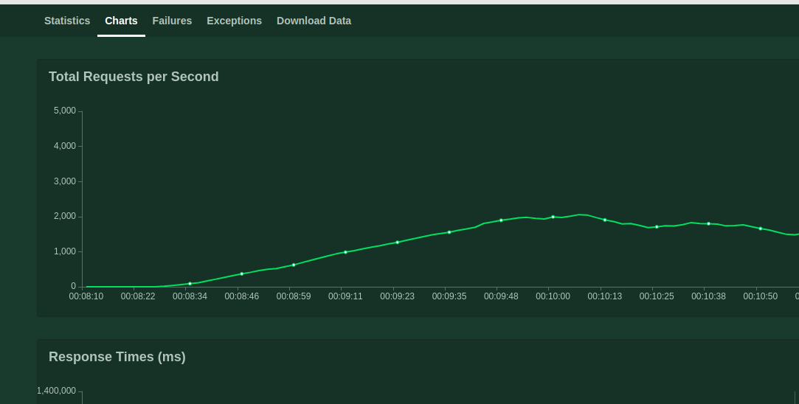
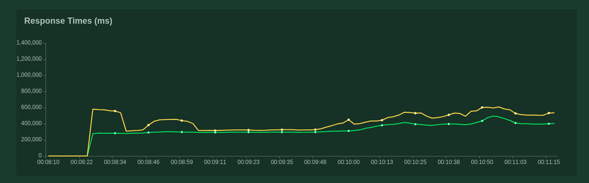
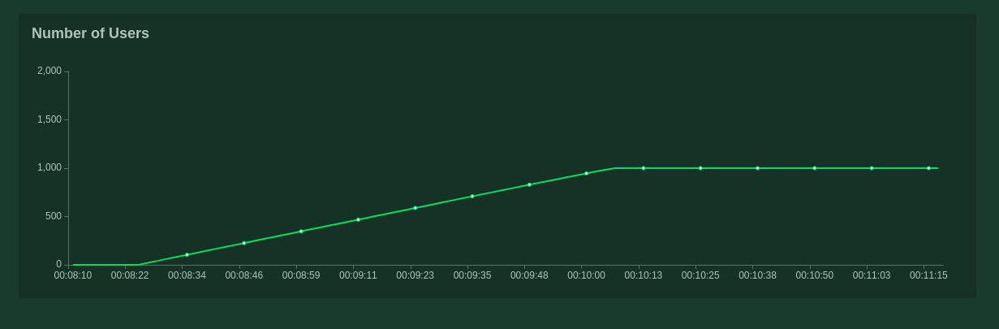

## Result

### Statistics in Table Format

|**Method**|**Name**|**#requests**|**#failures**|**Median response time**|**Average response time**|**Min response time**|**Max response time**|**Average Content Size**|**Requests/s**|
|----------|--------|-------------|-------------|------------------------|-------------------------|---------------------|---------------------|------------------------|--------------|
|GET|key1|196029|0|322000|352540|252437|4128581|6|1363.53|
|None|Total|196029|0|322000|352540|252437|4128581|6|1363.53|

### Graph (Total Requests Per Second)

### Graph (Total Response (ms))

### Graph (Number of Users)

