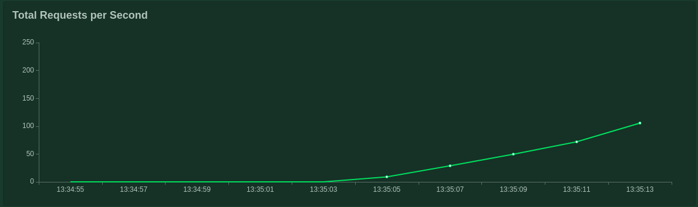
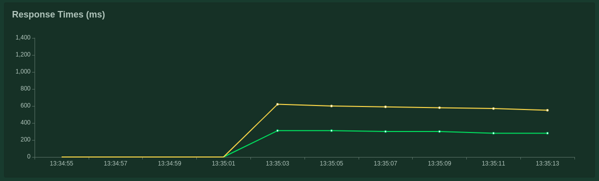
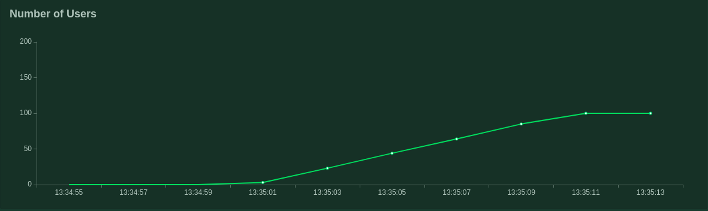

## Result

### Statistics in Table Format

| **Method** | **Name**  | **#requests** | **#failures** | **Median response time** | **Average response time** | **Min response time** | **Max response time** | **Average Content Size** |**Requests/s** |
| ------ | ----- | ---------- | ---------- | -------------------- | --------------------- | ----------------- | ----------------- | -------------------- | ---------- |
| GET    | key1  | 1320       | 0          | 310                  | 314                   | 258               | 661               | 6                    | 100.16     |
| write  | key1  | 8          | 0          | 300                  | 297                   | 267               | 310               | 1                    | 0.61       |
| write  | key10 | 6          | 0          | 270                  | 283                   | 266               | 309               | 1                    | 0.46       |
| write  | key11 | 7          | 0          | 280                  | 285                   | 266               | 307               | 1                    | 0.53       |
| write  | key12 | 11         | 0          | 310                  | 331                   | 301               | 584               | 1                    | 0.83       |
| write  | key13 | 1          | 0          | 290                  | 291                   | 291               | 291               | 1                    | 0.08       |
| write  | key14 | 4          | 0          | 290                  | 291                   | 264               | 307               | 1                    | 0.3        |
| write  | key15 | 4          | 0          | 280                  | 290                   | 280               | 307               | 1                    | 0.3        |
| write  | key16 | 7          | 0          | 310                  | 299                   | 270               | 316               | 1                    | 0.53       |
| write  | key17 | 8          | 0          | 310                  | 300                   | 272               | 313               | 1                    | 0.61       |
| write  | key18 | 3          | 0          | 310                  | 297                   | 271               | 312               | 1                    | 0.23       |
| write  | key19 | 10         | 0          | 310                  | 350                   | 265               | 572               | 1                    | 0.76       |
| write  | key2  | 6          | 0          | 300                  | 291                   | 268               | 309               | 1                    | 0.46       |
| write  | key20 | 17         | 0          | 300                  | 299                   | 267               | 330               | 1                    | 1.29       |
| write  | key21 | 10         | 0          | 310                  | 302                   | 287               | 310               | 1                    | 0.76       |
| write  | key22 | 5          | 0          | 310                  | 359                   | 292               | 588               | 1                    | 0.38       |
| write  | key23 | 5          | 0          | 300                  | 290                   | 268               | 309               | 1                    | 0.38       |
| write  | key24 | 9          | 0          | 290                  | 287                   | 264               | 316               | 1                    | 0.68       |
| write  | key25 | 3          | 0          | 310                  | 307                   | 307               | 308               | 1                    | 0.23       |
| write  | key26 | 5          | 0          | 310                  | 344                   | 267               | 568               | 1                    | 0.38       |
| write  | key27 | 5          | 0          | 300                  | 298                   | 289               | 309               | 1                    | 0.38       |
| write  | key28 | 13         | 0          | 300                  | 295                   | 268               | 309               | 1                    | 0.99       |
| write  | key29 | 7          | 0          | 280                  | 286                   | 265               | 331               | 1                    | 0.53       |
| write  | key3  | 5          | 0          | 300                  | 295                   | 274               | 306               | 1                    | 0.38       |
| write  | key30 | 2          | 0          | 310                  | 308                   | 308               | 309               | 1                    | 0.15       |
| write  | key31 | 2          | 0          | 280                  | 287                   | 284               | 291               | 1                    | 0.15       |
| write  | key32 | 3          | 0          | 310                  | 305                   | 293               | 313               | 1                    | 0.23       |
| write  | key33 | 6          | 0          | 290                  | 339                   | 280               | 566               | 1                    | 0.46       |
| write  | key34 | 10         | 0          | 290                  | 294                   | 269               | 307               | 1                    | 0.76       |
| write  | key35 | 1          | 0          | 290                  | 287                   | 287               | 287               | 1                    | 0.08       |
| write  | key36 | 4          | 0          | 290                  | 290                   | 268               | 305               | 1                    | 0.3        |
| write  | key37 | 6          | 0          | 310                  | 354                   | 306               | 587               | 1                    | 0.46       |
| write  | key38 | 4          | 0          | 290                  | 291                   | 273               | 304               | 1                    | 0.3        |
| write  | key39 | 9          | 0          | 310                  | 305                   | 288               | 310               | 1                    | 0.68       |
| write  | key4  | 10         | 0          | 300                  | 336                   | 269               | 728               | 1                    | 0.76       |
| write  | key40 | 3          | 0          | 300                  | 305                   | 281               | 331               | 1                    | 0.23       |
| write  | key41 | 4          | 0          | 310                  | 309                   | 308               | 313               | 1                    | 0.3        |
| write  | key42 | 8          | 0          | 310                  | 307                   | 300               | 309               | 1                    | 0.61       |
| write  | key43 | 4          | 0          | 310                  | 302                   | 287               | 309               | 1                    | 0.3        |
| write  | key44 | 5          | 0          | 290                  | 293                   | 272               | 310               | 1                    | 0.38       |
| write  | key45 | 6          | 0          | 290                  | 289                   | 268               | 311               | 1                    | 0.46       |
| write  | key46 | 3          | 0          | 290                  | 289                   | 269               | 309               | 1                    | 0.23       |
| write  | key47 | 3          | 0          | 300                  | 305                   | 305               | 307               | 1                    | 0.23       |
| write  | key48 | 14         | 0          | 310                  | 300                   | 268               | 323               | 1                    | 1.06       |
| write  | key49 | 4          | 0          | 300                  | 301                   | 288               | 308               | 1                    | 0.3        |
| write  | key5  | 9          | 0          | 300                  | 300                   | 288               | 309               | 1                    | 0.68       |
| write  | key50 | 7          | 0          | 300                  | 365                   | 267               | 572               | 1                    | 0.53       |
| write  | key51 | 9          | 0          | 310                  | 303                   | 290               | 309               | 1                    | 0.68       |
| write  | key52 | 8          | 0          | 300                  | 302                   | 287               | 311               | 1                    | 0.61       |
| write  | key53 | 3          | 0          | 310                  | 301                   | 288               | 309               | 1                    | 0.23       |
| write  | key54 | 11         | 0          | 310                  | 299                   | 268               | 314               | 1                    | 0.83       |
| write  | key55 | 6          | 0          | 310                  | 311                   | 307               | 328               | 1                    | 0.46       |
| write  | key58 | 3          | 0          | 310                  | 307                   | 306               | 310               | 1                    | 0.23       |
| write  | key59 | 8          | 0          | 310                  | 305                   | 287               | 311               | 1                    | 0.61       |
| write  | key6  | 5          | 0          | 300                  | 359                   | 292               | 571               | 1                    | 0.38       |
| write  | key60 | 1          | 0          | 310                  | 308                   | 308               | 308               | 1                    | 0.08       |
| write  | key61 | 14         | 0          | 310                  | 307                   | 268               | 345               | 1                    | 1.06       |
| write  | key62 | 4          | 0          | 280                  | 287                   | 273               | 308               | 1                    | 0.3        |
| write  | key63 | 4          | 0          | 300                  | 305                   | 301               | 309               | 1                    | 0.3        |
| write  | key64 | 6          | 0          | 310                  | 350                   | 271               | 621               | 1                    | 0.46       |
| write  | key65 | 2          | 0          | 290                  | 296                   | 286               | 307               | 1                    | 0.15       |
| write  | key66 | 1          | 0          | 290                  | 289                   | 289               | 289               | 1                    | 0.08       |
| write  | key67 | 3          | 0          | 300                  | 292                   | 269               | 308               | 1                    | 0.23       |
| write  | key68 | 4          | 0          | 310                  | 313                   | 306               | 327               | 1                    | 0.3        |
| write  | key69 | 2          | 0          | 270                  | 283                   | 271               | 295               | 1                    | 0.15       |
| write  | key7  | 10         | 0          | 300                  | 302                   | 288               | 310               | 1                    | 0.76       |
| write  | key70 | 8          | 0          | 290                  | 288                   | 265               | 314               | 1                    | 0.61       |
| write  | key71 | 11         | 0          | 270                  | 280                   | 265               | 310               | 1                    | 0.83       |
| write  | key72 | 14         | 0          | 290                  | 289                   | 266               | 309               | 1                    | 1.06       |
| write  | key73 | 3          | 0          | 290                  | 291                   | 283               | 304               | 1                    | 0.23       |
| write  | key74 | 5          | 0          | 290                  | 291                   | 268               | 309               | 1                    | 0.38       |
| write  | key75 | 4          | 0          | 280                  | 291                   | 267               | 307               | 1                    | 0.3        |
| write  | key76 | 4          | 0          | 270                  | 286                   | 267               | 307               | 1                    | 0.3        |
| write  | key77 | 1          | 0          | 260                  | 264                   | 264               | 264               | 1                    | 0.08       |
| write  | key78 | 6          | 0          | 310                  | 307                   | 300               | 312               | 1                    | 0.46       |
| write  | key79 | 6          | 0          | 310                  | 354                   | 289               | 600               | 1                    | 0.46       |
| write  | key8  | 10         | 0          | 280                  | 286                   | 267               | 307               | 1                    | 0.76       |
| write  | key80 | 1          | 0          | 270                  | 267                   | 267               | 267               | 1                    | 0.08       |
| write  | key81 | 6          | 0          | 310                  | 303                   | 289               | 309               | 1                    | 0.46       |
| write  | key82 | 9          | 0          | 310                  | 304                   | 289               | 312               | 1                    | 0.68       |
| write  | key83 | 1          | 0          | 580                  | 584                   | 584               | 584               | 1                    | 0.08       |
| write  | key84 | 4          | 0          | 290                  | 288                   | 273               | 309               | 1                    | 0.3        |
| write  | key85 | 6          | 0          | 310                  | 305                   | 289               | 310               | 1                    | 0.46       |
| write  | key86 | 9          | 0          | 300                  | 299                   | 269               | 313               | 1                    | 0.68       |
| write  | key87 | 2          | 0          | 270                  | 289                   | 270               | 309               | 1                    | 0.15       |
| write  | key88 | 1          | 0          | 310                  | 309                   | 309               | 309               | 1                    | 0.08       |
| write  | key89 | 4          | 0          | 310                  | 304                   | 290               | 312               | 1                    | 0.3        |
| write  | key9  | 7          | 0          | 300                  | 290                   | 268               | 306               | 1                    | 0.53       |
| write  | key90 | 8          | 0          | 290                  | 288                   | 264               | 309               | 1                    | 0.61       |
| write  | key91 | 12         | 0          | 300                  | 304                   | 292               | 312               | 1                    | 0.91       |
| write  | key92 | 4          | 0          | 290                  | 296                   | 283               | 308               | 1                    | 0.3        |
| write  | key93 | 1          | 0          | 270                  | 270                   | 270               | 270               | 1                    | 0.08       |
| write  | key94 | 2          | 0          | 280                  | 285                   | 284               | 287               | 1                    | 0.15       |
| write  | key95 | 6          | 0          | 300                  | 296                   | 270               | 309               | 1                    | 0.46       |
| write  | key96 | 1          | 0          | 290                  | 288                   | 288               | 288               | 1                    | 0.08       |
| write  | key97 | 12         | 0          | 310                  | 298                   | 272               | 310               | 1                    | 0.91       |
| write  | key98 | 7          | 0          | 310                  | 349                   | 308               | 581               | 1                    | 0.53       |
| write  | key99 | 6          | 0          | 300                  | 301                   | 269               | 326               | 1                    | 0.46       |
| None   | Total | 1891       | 0          | 310                  | 311                   | 258               | 728               | 4                    | 143.49     |

### Graph (Total Requests Per Second)

### Graph (Total Response (ms))

### Graph (Number of Users)

